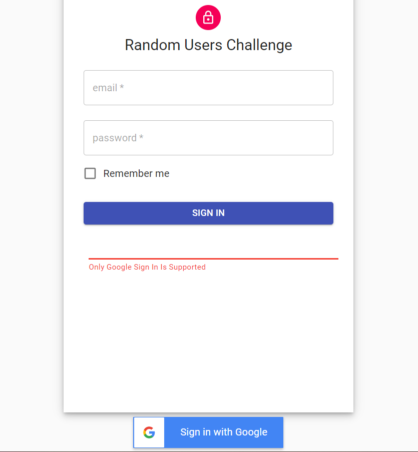
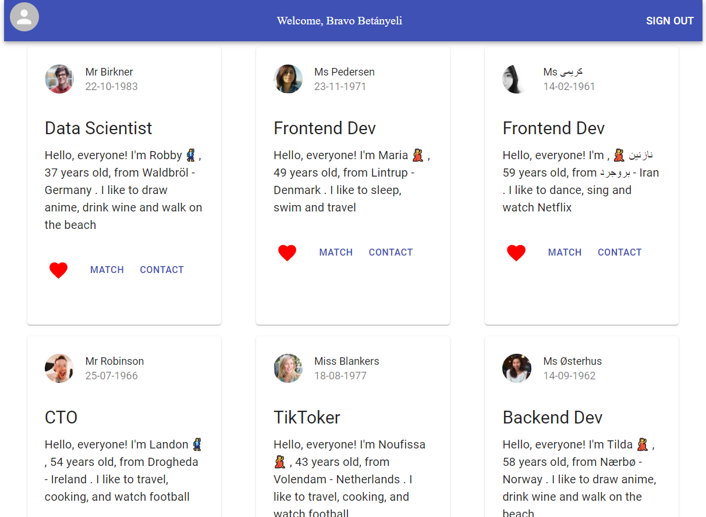
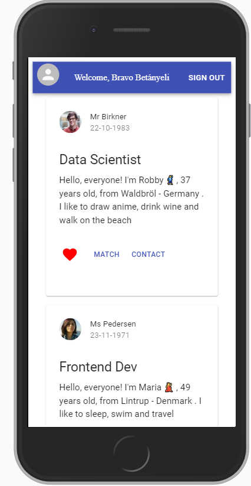
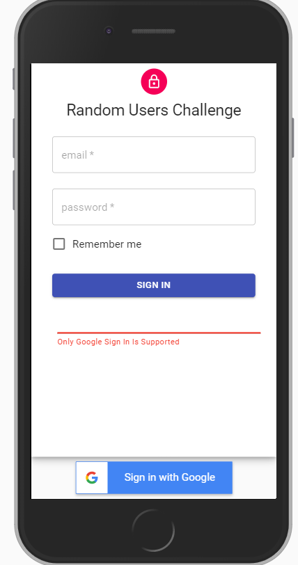

# random_challenge
A random user generators app.

## Start 

- Run in terminal `npm install`
- Run  `npm start`
- :warning: .env file contains enviroments variables for Firebase.

## :point_right:Functional requirements
- The user must be able to enter from a url.
- The user must be able to Login with Google Account.
- The user must be able to Logout.
- The user should see a message if their login was successful or not.
- The User must be able to see the generated random list

## :point_up_2: Non-Functional requirements
- Responsive WebApp.
- Simplicity
- Unit Test

## :computer:Tech Stack
- Frontend UI
    - JavaScript ES6
    - CSS3
    - ReactJs
    - Material UI
    - MomentJs from date format

- Backend
    - Amplify AWS CloudFront & S3

- Auth Services
    - Firebase Auth

- Api Request
    - Axios
    - RandomUsers Api

- Test (Not yet implemented) :warning:
    - Jest
    - Enzyme
    - Babel config

- Project Management Tool
    -  [Github Project](https://github.com/betanyeli/random_challenge)

- Sprint duration
    - 5 days.

## :collision: AWS CLOUDFRONT DEPLOY :collision:
- :warning:FIRST! Create An AWS develop Account :warning:
- Run in terminal `npm install -g @aws-amplify/cli`
- Run in terminal `Amplify Configure` and login in your AWS Account
- Run in terminal `Amplify Init` for initialize a new Project
- Run  in terminal `Amplify add hosting` in the path of your project.
    - Select AWS CloudFront & S3 Bucket
    - Select DEV option for HTTP or PROD for HTTPS.
- Run in terminal `Amplify publish` 

## HIGH-fidelity PROTOTYPE

### Desktop

### Mobile

Develop by Betányeli. :eyes:
